# 🩺 Clinical AI Assistant

An AI-powered clinical decision support prototype that helps doctors quickly understand a patient's complete medical history by transforming scattered medical records into an organized, evidence-backed clinical workspace.

This project demonstrates how AI can reduce the time required to review years of patient records, highlight important diagnoses, visualize disease progression, identify clinical risks, and assist doctors during emergencies.

> ⚠️ This is a demonstration prototype created for educational and hackathon purposes. It is **not intended for real clinical use**.

---

# 🎯 Problem Statement

Doctors often receive patients with years of scattered medical records including laboratory reports, prescriptions, discharge summaries, imaging reports, and consultation notes.

Reviewing every document manually is time-consuming, especially during emergencies where treatment decisions must be made within minutes.

Clinical AI Assistant solves this problem by using AI to:

- Summarize longitudinal patient history
- Extract important diagnoses
- Generate evidence-backed clinical summaries
- Compare reports across multiple years
- Detect important trends automatically
- Provide emergency-ready patient information within seconds

---

# ✨ Features

## 🏥 Doctor Dashboard

- Personalized doctor workspace
- Patient overview dashboard
- Clinical statistics
- Emergency alerts
- AI activity status

---

## 👨‍⚕️ Patient Directory

Search patients using:

- Patient Name
- Unique Patient ID
- Medical condition

Includes:

- Patient priority
- Current status
- Primary conditions
- Quick profile access

---

## 📄 AI Clinical Summary

Automatically generates:

- Executive clinical overview
- Active diagnoses
- Medication history
- Drug allergies
- Laboratory abnormalities
- Longitudinal biomarker trends
- Clinical risk factors
- Surgical history

Every section contains evidence links to the originating medical reports.

---

## 📂 Medical Report Timeline

Displays chronological medical history including:

- Laboratory reports
- Prescriptions
- Imaging
- Discharge summaries
- Consultation records

---

## 📈 Trend Analysis

Automatically compares historical records and visualizes:

- Blood Pressure
- HbA1c
- Kidney Function
- Creatinine
- eGFR
- Cholesterol
- Weight progression

AI also generates clinical observations from these trends.

---

## 🚨 Emergency Mode

Provides a rapid emergency summary including:

- Critical allergies
- High-risk medications
- Important laboratory abnormalities
- Emergency contact information
- Immediate clinical warnings

Designed to assist during emergency situations where rapid access to essential patient information is required.

---

## 💬 AI Clinical Assistant

Doctors can ask natural language questions such as:

- Why is the patient's kidney function worsening?
- Show diabetes progression.
- What medications changed over time?
- What caused the abnormal laboratory values?
- Summarize all reports from the last two years.

---

## 📤 Report Upload

Supports uploading new medical reports to simulate continuous patient record updates.

Future reports can be incorporated into AI-generated summaries.

---

# 📸 Screenshots

## Dashboard

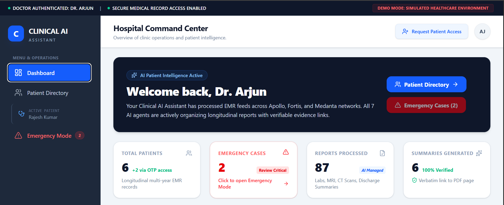

---

## Patient Directory

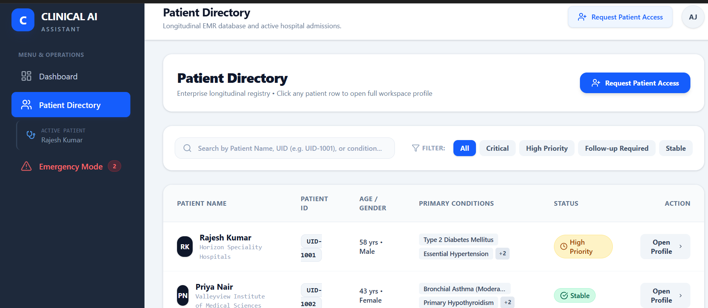

---

## Patient Clinical Workspace

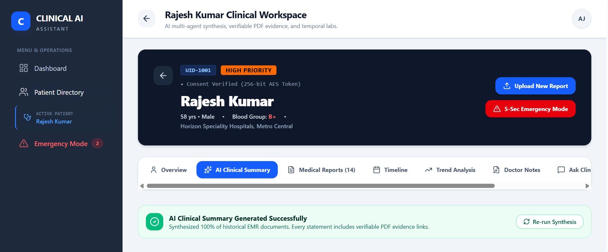

---

## AI Clinical Summary

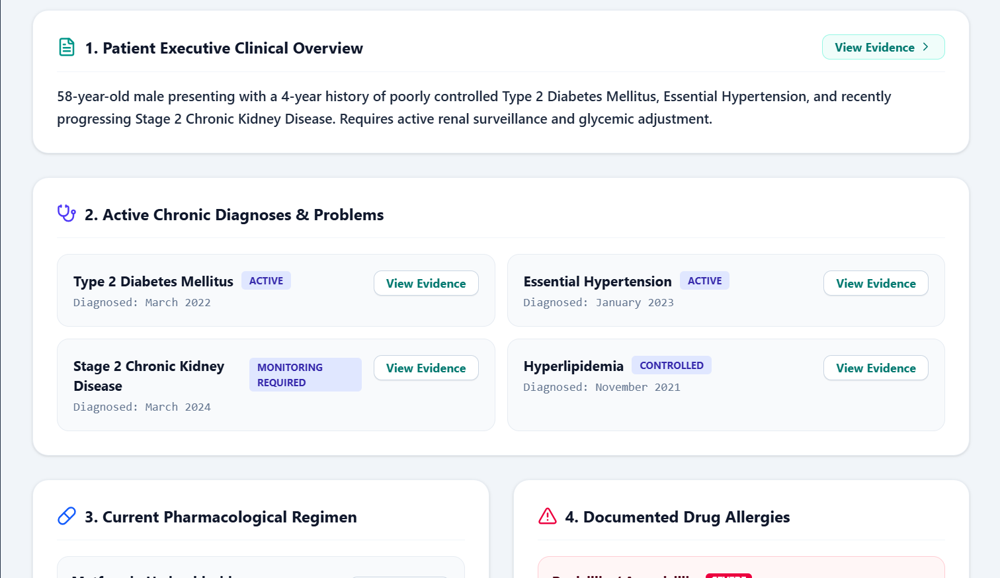

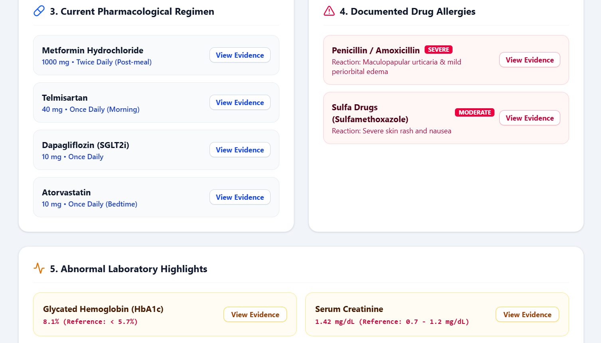

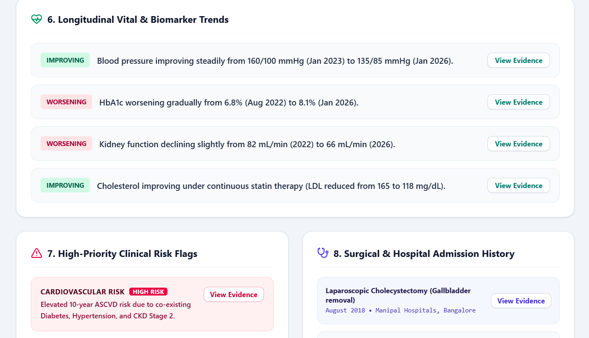

---

## Timeline

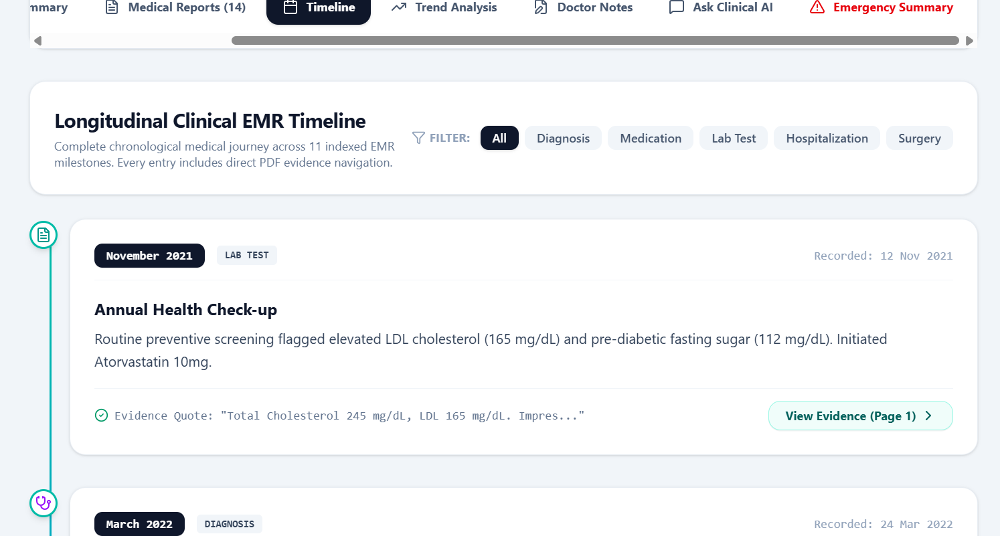

---

## Trend Analysis

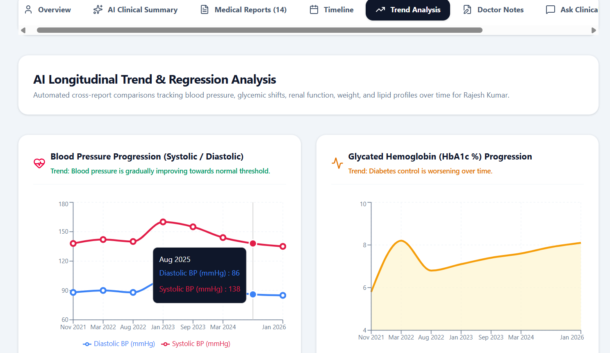

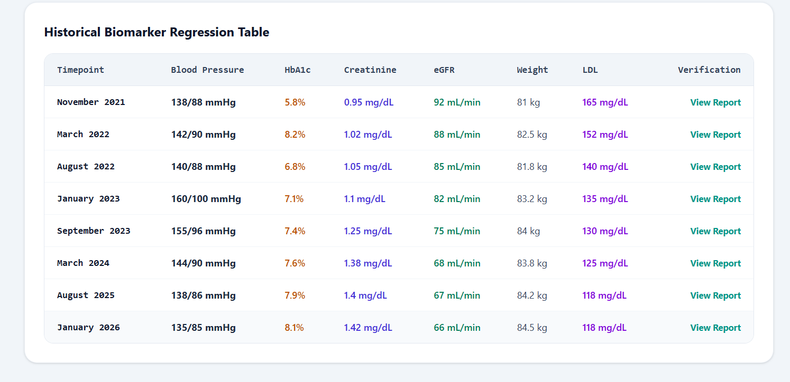

---

## Emergency Mode

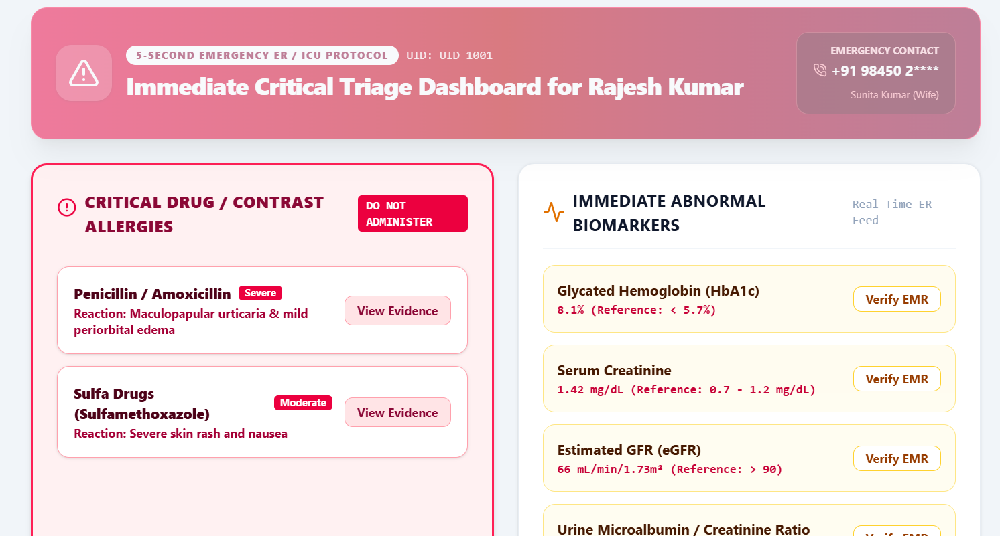

---

## AI Clinical Chat

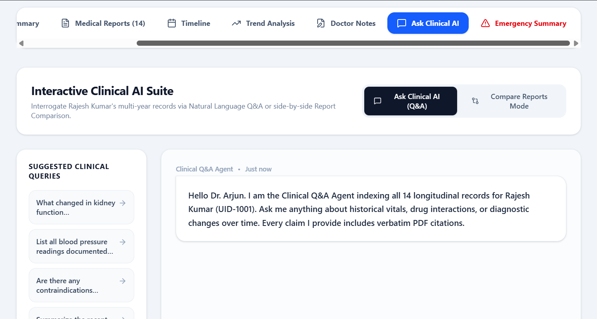

---

# 🔒 Privacy & Disclaimer

This project uses **fictional patient information** created solely for demonstration purposes.

No real patient records, personal health information, or confidential hospital data are included.

Any resemblance to actual persons, hospitals, or medical records is purely coincidental.

---

# 🚀 Future Improvements

- OCR-based PDF extraction
- Voice-enabled doctor assistant
- Multi-patient AI comparison
- FHIR/HL7 interoperability
- Hospital EMR integration
- Multi-language support
- Predictive risk scoring
- Secure authentication and role-based access
- Real-time report ingestion

---

# 👨‍💻 Author

**Athul**

B.Tech Computer Science & Engineering (AI & ML)

Passionate about Artificial Intelligence, Healthcare AI, Machine Learning, and Software Development.

---

⭐ If you found this project interesting, consider giving it a star.

